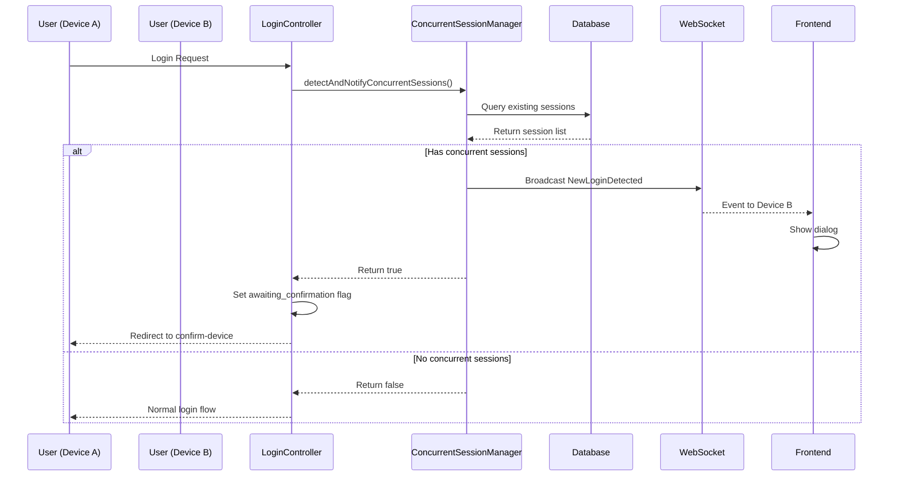
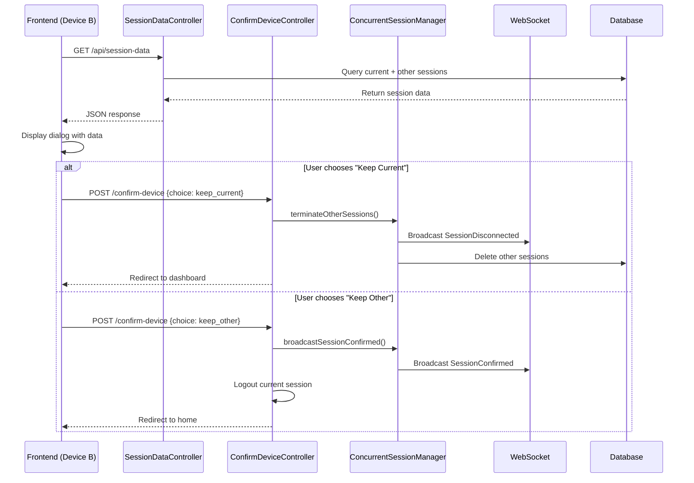

# Architecture Documentation - Concurrent Session Management

This document provides detailed technical architecture information for the concurrent session management system.

## 🏗️ System Architecture

### High-Level Overview

```
┌─────────────────────────────────────────────────────────────────┐
│                        Frontend (Vue.js)                        │
├─────────────────────────────────────────────────────────────────┤
│  SessionMonitor.vue  │  ConcurrentSessionDialog.vue  │  Pages   │
│  ├─ useSessionMonitor.ts (Composable)                           │
│  ├─ WebSocket Listeners (Laravel Echo)                          │
│  └─ API Calls (Axios)                                           │
└─────────────────┬───────────────────────────────────────────────┘
                  │
                  │ HTTP/WebSocket
                  │
┌─────────────────▼───────────────────────────────────────────────┐
│                       Backend (Laravel)                         │
├─────────────────────────────────────────────────────────────────┤
│  Controllers     │  Middleware      │  Services                 │
│  ├─ ConfirmDevice│  ├─ ConfirmSession│  └─ ConcurrentSession    │
│  └─ SessionData  │  └─ Auth         │     Manager               │
├─────────────────────────────────────────────────────────────────┤
│  Events          │  Broadcasting    │  Queue System             │
│  ├─ NewLogin     │  ├─ Pusher       │  └─ Database/Redis        │
│  ├─ SessionConf. │  └─ WebSocket    │                           │
│  └─ SessionDisc. │                  │                           │
└─────────────────┬───────────────────────────────────────────────┘
                  │
                  │ Database Queries
                  │
┌─────────────────▼───────────────────────────────────────────────┐
│                      Database (MySQL/PostgreSQL)                │
├─────────────────────────────────────────────────────────────────┤
│  sessions table  │  users table     │  Other tables             │
│  ├─ id           │  ├─ id           │                           │
│  ├─ user_id      │  ├─ email        │                           │
│  ├─ ip_address   │  └─ ...          │                           │
│  ├─ user_agent   │                  │                           │
│  └─ last_activity│                  │                           │
└─────────────────────────────────────────────────────────────────┘
```

---

## 🔄 Data Flow

### 1. Login Detection Flow



### 2. Dialog Interaction Flow



---

## 🧩 Component Architecture

### Backend Components

#### 1. ConcurrentSessionManager (Service)

**Purpose**: Core business logic for session management

**Key Methods**:
```php
class ConcurrentSessionManager
{
    // Detection and notification
    public function detectAndNotifyConcurrentSessions(int $userId, string $newSessionId, array $deviceInfo): bool
    
    // Session management
    public function getOtherSessions(int $userId, string $currentSessionId): Collection
    public function terminateOtherSessions(int $userId, string $currentSessionId, string $reason): void
    public function clearConfirmationFlags(int $userId, string $excludeSessionId): void
    
    // Broadcasting
    public function broadcastNewLoginDetected(int $userId, string $existingSessionId, array $newDeviceInfo): void
    public function broadcastSessionDisconnected(int $userId, string $sessionId, string $reason): void
    public function broadcastSessionConfirmed(int $userId, string $currentSessionId): void
    
    // Utilities
    public function parseUserAgent(?string $userAgent): string
}
```

**Design Patterns**:
- **Service Pattern**: Encapsulates business logic
- **Event-Driven**: Uses Laravel events for broadcasting
- **Single Responsibility**: Each method has one clear purpose

#### 2. ConfirmDeviceController

**Purpose**: Handle user choices and session confirmation

**Key Methods**:
```php
class ConfirmDeviceController
{
    public function show(Request $request): Response|RedirectResponse
    public function confirm(Request $request, ConcurrentSessionManager $sessionManager): RedirectResponse
    private function parseUserAgent(string $userAgent): string
}
```

**Responsibilities**:
- Display confirmation page (fallback)
- Process user choices
- Coordinate with ConcurrentSessionManager
- Handle redirects and responses

#### 3. SessionDataController (API)

**Purpose**: Provide session data for frontend dialog

**Key Methods**:
```php
class SessionDataController
{
    public function index(Request $request, ConcurrentSessionManager $sessionManager): JsonResponse
}
```

**Response Format**:
```json
{
    "currentDevice": {
        "ip_address": "192.168.1.100",
        "user_agent": "Chrome on Windows"
    },
    "otherDevices": [
        {
            "id": "session-123",
            "ip_address": "192.168.1.101",
            "user_agent": "Safari on Mac",
            "last_activity": "2 minutes ago"
        }
    ]
}
```

#### 4. ConfirmSessionMiddleware

**Purpose**: Minimal middleware (simplified in dialog approach)

```php
class ConfirmSessionMiddleware
{
    public function handle(Request $request, Closure $next): Response
    {
        // Minimal implementation - WebSocket handles most logic
        return $next($request);
    }
}
```

**Note**: In the dialog approach, this middleware is simplified because:
- Session detection happens in login controller
- WebSocket events trigger frontend dialog
- No redirect logic needed

### Frontend Components

#### 1. useSessionMonitor (Composable)

**Purpose**: Centralized state management for session monitoring

**State**:
```typescript
export function useSessionMonitor() {
    const isDisconnected = ref(false);
    const showConcurrentSessionDialog = ref(false);
    const sessionData = ref<SessionData | null>(null);
    const isFetchingSessionData = ref(false);
    const currentSessionId = ref<string | null>(null);
}
```

**Key Features**:
- **WebSocket Management**: Sets up Echo listeners
- **State Management**: Reactive state for UI components
- **Data Pre-fetching**: Loads session data before showing dialog
- **Event Handling**: Processes all session-related events

#### 2. SessionMonitor.vue

**Purpose**: Global component that orchestrates session monitoring

**Template**:
```vue
<template>
    <SessionDisconnectedAlert v-if="isDisconnected" />
    <ConcurrentSessionDialog 
        :open="showConcurrentSessionDialog"
        :session-data="sessionData"
        @close="closeConcurrentSessionDialog"
    />
</template>
```

**Responsibilities**:
- Initialize session monitoring on mount
- Render appropriate UI components
- Pass data between composable and components

#### 3. ConcurrentSessionDialog.vue

**Purpose**: Modal dialog for concurrent session handling

**Key Features**:
- **Pre-loaded Data**: Receives session data as prop
- **Device Display**: Shows current and other devices
- **User Actions**: Handle "keep current" vs "keep other"
- **Error Handling**: Graceful error states
- **Responsive Design**: Works on all screen sizes

**Props**:
```typescript
interface Props {
    open: boolean;
    sessionData?: SessionData | null;
}
```

#### 4. SessionDisconnectedAlert.vue

**Purpose**: Alert shown when session is disconnected

**Features**:
- Auto-dismiss after 3 seconds
- Clear messaging
- Countdown timer
- Automatic page reload

---

## 🔄 Event System

### Laravel Events

#### 1. NewLoginDetected

```php
class NewLoginDetected implements ShouldBroadcast
{
    public int $userId;
    public string $existingSessionId;
    public array $newDeviceInfo;
    
    public function broadcastOn(): array
    {
        return [
            new PrivateChannel("session.{$this->existingSessionId}"),
        ];
    }
}
```

**Triggered**: When new login detected on existing session  
**Received**: By existing session's frontend  
**Action**: Show concurrent session dialog

#### 2. SessionDisconnected

```php
class SessionDisconnected implements ShouldBroadcast
{
    public int $userId;
    public string $sessionId;
    public string $reason;
    
    public function broadcastOn(): array
    {
        return [
            new PrivateChannel("session.{$this->sessionId}"),
        ];
    }
}
```

**Triggered**: When session is terminated  
**Received**: By terminated session's frontend  
**Action**: Show disconnection alert, reload page

#### 3. SessionConfirmed

```php
class SessionConfirmed implements ShouldBroadcast
{
    public int $userId;
    public string $sessionId;
    public string $action;
    
    public function broadcastOn(): array
    {
        return [
            new PrivateChannel("session.{$this->sessionId}"),
        ];
    }
}
```

**Triggered**: When user chooses "keep other device"  
**Received**: By other session's frontend  
**Action**: Close dialog, continue working

### WebSocket Channels

**Channel Pattern**: `session.{sessionId}`  
**Channel Type**: Private (authenticated)  
**Authorization**: User can only listen to their own sessions

```php
// routes/channels.php
Broadcast::channel('session.{sessionId}', function ($user, $sessionId) {
    // Verify user owns this session
    return DB::table('sessions')
        ->where('id', $sessionId)
        ->where('user_id', $user->id)
        ->exists();
});
```

---

## 🗄️ Database Schema

### Sessions Table

```sql
CREATE TABLE sessions (
    id VARCHAR(255) PRIMARY KEY,
    user_id BIGINT UNSIGNED NULL,
    ip_address VARCHAR(45) NULL,
    user_agent TEXT NULL,
    payload LONGTEXT NOT NULL,
    last_activity INT NOT NULL,
    
    -- Optional enhancements
    confirmed_at TIMESTAMP NULL,
    device_name VARCHAR(255) NULL,
    is_trusted BOOLEAN DEFAULT FALSE,
    
    INDEX sessions_user_id_index (user_id),
    INDEX sessions_last_activity_index (last_activity)
);
```

**Key Fields**:
- `id`: Session identifier (Laravel default)
- `user_id`: Links session to user
- `ip_address`: For device identification
- `user_agent`: For browser/OS detection
- `last_activity`: For "last seen" timestamps

**Queries Used**:
```sql
-- Find other sessions for user
SELECT * FROM sessions 
WHERE user_id = ? AND id != ? 
ORDER BY last_activity DESC;

-- Count concurrent sessions
SELECT COUNT(*) FROM sessions 
WHERE user_id = ? AND id != ?;

-- Delete other sessions
DELETE FROM sessions 
WHERE user_id = ? AND id != ?;
```

---

## 🔒 Security Architecture

### Authentication & Authorization

**API Endpoints**:
- All protected by `auth` middleware
- Session validation ensures user owns sessions
- CSRF protection on POST requests

**WebSocket Channels**:
- Private channels require authentication
- Channel authorization verifies session ownership
- No cross-user session access possible

**Session Management**:
- Only user can manage their own sessions
- Session IDs are cryptographically secure
- No session data exposed to unauthorized users

### Data Validation

**Input Validation**:
```php
// ConfirmDeviceController
$validated = $request->validate([
    'choice' => 'required|in:keep_current,keep_other',
]);
```

**Session Validation**:
```php
// Verify session exists and belongs to user
$session = DB::table('sessions')
    ->where('id', $sessionId)
    ->where('user_id', $userId)
    ->first();
```

### Rate Limiting

**Potential Enhancements**:
```php
// Prevent rapid session creation
Route::middleware(['throttle:10,1'])->group(function () {
    Route::post('/confirm-device', [ConfirmDeviceController::class, 'confirm']);
});
```

---

## ⚡ Performance Considerations

### Database Optimization

**Indexes**:
- `sessions.user_id` - For finding user sessions
- `sessions.last_activity` - For ordering by activity
- Composite index on `(user_id, last_activity)` for optimal queries

**Query Optimization**:
```php
// Efficient session lookup
DB::table('sessions')
    ->select(['id', 'ip_address', 'user_agent', 'last_activity'])
    ->where('user_id', $userId)
    ->where('id', '!=', $currentSessionId)
    ->orderBy('last_activity', 'desc')
    ->limit(10) // Reasonable limit
    ->get();
```

### Caching Strategy

**Session Data Caching**:
```php
// Cache user sessions for 1 minute
$sessions = Cache::remember(
    "user_sessions_{$userId}",
    60,
    fn() => $this->getOtherSessions($userId, $currentSessionId)
);
```

**Cache Invalidation**:
```php
// Clear cache when sessions change
Cache::forget("user_sessions_{$userId}");
```

### WebSocket Performance

**Connection Management**:
- Use connection pooling
- Implement heartbeat/keepalive
- Handle reconnection gracefully

**Event Optimization**:
- Minimal event payloads
- Batch events when possible
- Use queues for broadcasting

### Frontend Performance

**Component Optimization**:
- Lazy load dialog component
- Pre-fetch session data
- Minimize re-renders

**Memory Management**:
- Clean up WebSocket listeners
- Clear data when dialog closes
- Avoid memory leaks in composables

---

## 🔧 Configuration Options

### Environment Variables

```env
# Broadcasting
BROADCAST_DRIVER=pusher
PUSHER_APP_ID=your_app_id
PUSHER_APP_KEY=your_app_key
PUSHER_APP_SECRET=your_app_secret
PUSHER_APP_CLUSTER=your_cluster

# Session
SESSION_DRIVER=database
SESSION_LIFETIME=120

# Queue (for broadcasting)
QUEUE_CONNECTION=database
```

### Customizable Behaviors

**Session Timeout**:
```php
// config/session.php
'lifetime' => env('SESSION_LIFETIME', 120), // minutes
```

**Concurrent Session Limit**:
```php
// In ConcurrentSessionManager
private const MAX_CONCURRENT_SESSIONS = 5;

public function detectAndNotifyConcurrentSessions(...): bool
{
    $sessionCount = $this->getOtherSessions($userId, $newSessionId)->count();
    
    if ($sessionCount >= self::MAX_CONCURRENT_SESSIONS) {
        // Force terminate oldest sessions
        $this->terminateOldestSessions($userId, $newSessionId);
    }
    
    return $sessionCount > 0;
}
```

**Device Trust**:
```php
// Optional: Trust devices to skip confirmation
public function isDeviceTrusted(int $userId, string $deviceFingerprint): bool
{
    return DB::table('trusted_devices')
        ->where('user_id', $userId)
        ->where('fingerprint', $deviceFingerprint)
        ->exists();
}
```

---

## 🧪 Testing Architecture

### Backend Testing

**Unit Tests**:
```php
// Test ConcurrentSessionManager
public function test_detects_concurrent_sessions()
{
    $manager = new ConcurrentSessionManager();
    
    // Create existing session
    $this->createSession($userId = 1, $sessionId = 'existing');
    
    // Test detection
    $result = $manager->detectAndNotifyConcurrentSessions(
        $userId, 
        'new-session', 
        ['ip' => '127.0.0.1']
    );
    
    $this->assertTrue($result);
}
```

**Feature Tests**:
```php
// Test full flow
public function test_concurrent_session_flow()
{
    $user = User::factory()->create();
    
    // First login
    $this->actingAs($user)->post('/login', $credentials);
    
    // Second login should trigger confirmation
    $response = $this->actingAs($user)->post('/login', $credentials);
    $response->assertRedirect('/confirm-device');
    
    // API should return session data
    $response = $this->get('/api/session-data');
    $response->assertOk()->assertJsonStructure([
        'currentDevice', 'otherDevices'
    ]);
}
```

### Frontend Testing

**Component Tests**:
```typescript
// Test ConcurrentSessionDialog
import { mount } from '@vue/test-utils';
import ConcurrentSessionDialog from '@/components/ConcurrentSessionDialog.vue';

test('displays session data correctly', () => {
    const sessionData = {
        currentDevice: { ip_address: '127.0.0.1', user_agent: 'Chrome' },
        otherDevices: [{ id: '123', ip_address: '127.0.0.2' }]
    };
    
    const wrapper = mount(ConcurrentSessionDialog, {
        props: { open: true, sessionData }
    });
    
    expect(wrapper.text()).toContain('127.0.0.1');
    expect(wrapper.text()).toContain('Chrome');
});
```

**Integration Tests**:
```typescript
// Test WebSocket integration
test('shows dialog on new login event', async () => {
    const { result } = renderHook(() => useSessionMonitor());
    
    // Simulate WebSocket event
    window.Echo.private('session.123').trigger('.new-login-detected', {});
    
    await waitFor(() => {
        expect(result.current.showConcurrentSessionDialog.value).toBe(true);
    });
});
```

---

## 🔄 Deployment Architecture

### Production Setup

**Load Balancer**:
```
┌─────────────────┐
│  Load Balancer  │
│   (nginx/ALB)   │
└─────────┬───────┘
          │
    ┌─────┴─────┐
    │           │
┌───▼───┐   ┌───▼───┐
│App 1  │   │App 2  │
│Laravel│   │Laravel│
└───┬───┘   └───┬───┘
    │           │
    └─────┬─────┘
          │
    ┌─────▼─────┐
    │ Database  │
    │Redis/Queue│
    │WebSocket  │
    └───────────┘
```

**Session Affinity**:
- Not required (database sessions)
- WebSocket connections can be on any server
- Shared database ensures consistency

**Queue Workers**:
```bash
# Multiple queue workers for broadcasting
php artisan queue:work --queue=broadcasting,default --tries=3
```

### Monitoring

**Key Metrics**:
- Concurrent session detection rate
- Dialog interaction rates
- WebSocket connection health
- API response times
- Queue processing times

**Logging**:
```php
// Custom log channel for concurrent sessions
'channels' => [
    'concurrent_sessions' => [
        'driver' => 'daily',
        'path' => storage_path('logs/concurrent_sessions.log'),
        'level' => 'info',
    ],
],
```

---

## 🎯 Future Enhancements

### Potential Improvements

1. **Device Fingerprinting**: More sophisticated device identification
2. **Geolocation**: Show approximate location of sessions
3. **Session Analytics**: Track session patterns and usage
4. **2FA Integration**: Require 2FA for new device confirmation
5. **Selective Termination**: Allow terminating specific sessions
6. **Session Naming**: Let users name their devices
7. **Push Notifications**: Browser notifications for new logins

### Scalability Enhancements

1. **Redis Sessions**: For better performance at scale
2. **WebSocket Clustering**: Horizontal scaling of WebSocket servers
3. **Event Sourcing**: Track all session events for audit
4. **Microservices**: Extract session management to separate service

---

This architecture provides a solid foundation for concurrent session management while remaining flexible for future enhancements and scaling requirements.
